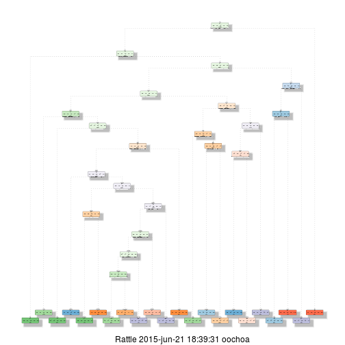

# Introduction to the project
Using devices such as Jawbone Up, Nike FuelBand, and Fitbit it is now possible to collect a large amount of data about personal activity relatively inexpensively. These type of devices are part of the quantified self movement – a group of enthusiasts who take measurements about themselves regularly to improve their health, to find patterns in their behavior, or because they are tech geeks. One thing that people regularly do is quantify how much of a particular activity they do, but they rarely quantify how well they do it. In this project, your goal will be to use data from accelerometers on the belt, forearm, arm, and dumbell of 6 participants. They were asked to perform barbell lifts correctly and incorrectly in 5 different ways. More information is available from the website here: http://groupware.les.inf.puc-rio.br/har (see the section on the Weight Lifting Exercise Dataset)

# Project Goal
The goal of your project is to predict the manner in which they did the exercise. This is the "classe" variable in the training set. We may use any of the other variables to predict with. In the report we will describe how we built the model, how we used cross validation, what we think the expected out of sample error is, and why we made the choices you did. We will use the prediction model to predict 20 different test cases. 

# Performance
Enable multi-core processing

```r
library(doParallel)
```

```
## Loading required package: foreach
## foreach: simple, scalable parallel programming from Revolution Analytics
## Use Revolution R for scalability, fault tolerance and more.
## http://www.revolutionanalytics.com
## Loading required package: iterators
## Loading required package: parallel
```

```r
cl <- makeCluster(detectCores())
registerDoParallel(cl)
```

# Getting the Data
The data for this project come from this source: http://groupware.les.inf.puc-rio.br/har. We are very thankful for their generosity in allowing their data to be used for this project. 

```r
trainFileUrl <- "http://d396qusza40orc.cloudfront.net/predmachlearn/pml-training.csv"
testFileUrl <- "http://d396qusza40orc.cloudfront.net/predmachlearn/pml-testing.csv"
```

We load the data directly to memory, no need to download the files. We will unify all the NA records in the files so we can handle them later on.
Of course we could have downloaded the data but we have considered the first option more clear for reproduction purposes so we skeptp that part of the code.

```r
training <- read.csv(url(trainFileUrl),na.string=c("NA","#DIV/0!",""))
testing <- read.csv(url(testFileUrl),na.string=c("NA","#DIV/0!",""))
```

# Pre-processing and cleaning

We will make several modifications on the data in order to get rid of all variables which aren't providing relevant information to our study based on the type of data, explained variance and missing values. All before setting up the training and validation sets.

1. Remove the 7 first columns because they are irrelevant for the study


```r
training1 <- training[,-c(1:7)]
```
2. We get rid of those variables with a few unique values so they don't explain much of the variance of the model we are trying to model


```r
library(caret)
```

```
## Loading required package: lattice
## Loading required package: ggplot2
```

```r
nzv <- nearZeroVar(training1)
training2 <- training1[, -nzv]
```
3. We won't be considering variables with more than 60% of NA


```r
longitud <- apply(training2, 2, function(x) length(which(!is.na(x))))
descarta <- as.vector(ifelse(longitud < 19622*0.6,NA,names(longitud)))
training3 <- training2[, names(training2) %in% descarta]
```
4. We make the same 'cleaning' process for the testing data


```r
testing1 <- testing[,-c(1:7)]
testing2 <- testing1[, -nzv]
testing3 <- testing2[, names(training2) %in% descarta]
```

5. Now we are going to split the training set in training and testing/validation


```r
library(kernlab)
inTrain <- createDataPartition(y=training3$classe, p=0.6,list=FALSE)
trainingSet <- training3[inTrain,]
testingSet <- training3[-inTrain,]        
testingSet1 <- testingSet[,-53]
```

# Training (Decission Tree and Random Forest)

Time for training the model. We will be using Decision Tree...


```r
library(rpart)
library(rpart.plot)
library(rattle)
```

```
## Rattle: A free graphical interface for data mining with R.
## Version 3.4.1 Copyright (c) 2006-2014 Togaware Pty Ltd.
## Type 'rattle()' to shake, rattle, and roll your data.
```

```r
modFit1 <- rpart(classe ~ ., data=trainingSet, method="class")
#modFit1
fancyRpartPlot(modFit1)
```

 

```r
predictions1 <- predict(modFit1, testingSet1, type = "class")
confusionMatrix(predictions1, testingSet$classe)
```

```
## Confusion Matrix and Statistics
## 
##           Reference
## Prediction    A    B    C    D    E
##          A 1994  306   22  110   59
##          B   42  720   60   17   57
##          C   59  158 1119  197  173
##          D   88  110   82  809   80
##          E   49  224   85  153 1073
## 
## Overall Statistics
##                                           
##                Accuracy : 0.7284          
##                  95% CI : (0.7184, 0.7382)
##     No Information Rate : 0.2845          
##     P-Value [Acc > NIR] : < 2.2e-16       
##                                           
##                   Kappa : 0.6554          
##  Mcnemar's Test P-Value : < 2.2e-16       
## 
## Statistics by Class:
## 
##                      Class: A Class: B Class: C Class: D Class: E
## Sensitivity            0.8934  0.47431   0.8180   0.6291   0.7441
## Specificity            0.9115  0.97219   0.9094   0.9451   0.9202
## Pos Pred Value         0.8005  0.80357   0.6559   0.6920   0.6774
## Neg Pred Value         0.9556  0.88518   0.9594   0.9286   0.9411
## Prevalence             0.2845  0.19347   0.1744   0.1639   0.1838
## Detection Rate         0.2541  0.09177   0.1426   0.1031   0.1368
## Detection Prevalence   0.3175  0.11420   0.2174   0.1490   0.2019
## Balanced Accuracy      0.9024  0.72325   0.8637   0.7871   0.8322
```

... and Random Forest


```r
library(randomForest)
```

```
## randomForest 4.6-10
## Type rfNews() to see new features/changes/bug fixes.
```

```r
modFit3 <- randomForest(classe ~. , data=trainingSet)
modFit3
```

```
## 
## Call:
##  randomForest(formula = classe ~ ., data = trainingSet) 
##                Type of random forest: classification
##                      Number of trees: 500
## No. of variables tried at each split: 7
## 
##         OOB estimate of  error rate: 0.73%
## Confusion matrix:
##      A    B    C    D    E class.error
## A 3344    4    0    0    0 0.001194743
## B   19 2251    9    0    0 0.012286090
## C    0   16 2035    3    0 0.009250243
## D    1    0   25 1901    3 0.015025907
## E    0    0    1    5 2159 0.002771363
```

```r
predictions3 <- predict(modFit3, testingSet1, type = "class")
confusionMatrix(predictions3, testingSet$classe)
```

```
## Confusion Matrix and Statistics
## 
##           Reference
## Prediction    A    B    C    D    E
##          A 2230   13    0    0    0
##          B    2 1499   18    0    0
##          C    0    6 1346   21    0
##          D    0    0    4 1264    5
##          E    0    0    0    1 1437
## 
## Overall Statistics
##                                          
##                Accuracy : 0.9911         
##                  95% CI : (0.9887, 0.993)
##     No Information Rate : 0.2845         
##     P-Value [Acc > NIR] : < 2.2e-16      
##                                          
##                   Kappa : 0.9887         
##  Mcnemar's Test P-Value : NA             
## 
## Statistics by Class:
## 
##                      Class: A Class: B Class: C Class: D Class: E
## Sensitivity            0.9991   0.9875   0.9839   0.9829   0.9965
## Specificity            0.9977   0.9968   0.9958   0.9986   0.9998
## Pos Pred Value         0.9942   0.9868   0.9803   0.9929   0.9993
## Neg Pred Value         0.9996   0.9970   0.9966   0.9967   0.9992
## Prevalence             0.2845   0.1935   0.1744   0.1639   0.1838
## Detection Rate         0.2842   0.1911   0.1716   0.1611   0.1832
## Detection Prevalence   0.2859   0.1936   0.1750   0.1622   0.1833
## Balanced Accuracy      0.9984   0.9922   0.9899   0.9908   0.9982
```

#Function to generate files with predictions to submit for assignment

We will use the model from the Random Forest training for because it gives us a much better prediction in the validations set, so it should work also fine in the testing set provided for the submission.

Added to that the needed files will be created with the following code.


```r
predictionsF <- predict(modFit3, testing3, type = "class")
pml_write_files = function(x){
  n = length(x)
  for(i in 1:n){
    filename = paste0("problem_id_",i,".txt")
    write.table(x[i],file=filename,quote=FALSE,row.names=FALSE,col.names=FALSE)
  }
}
pml_write_files(predictionsF)
```
